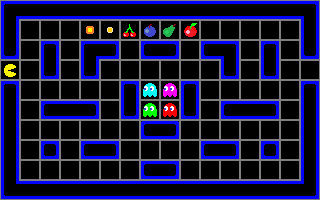
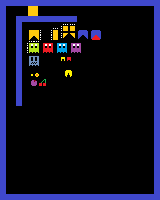
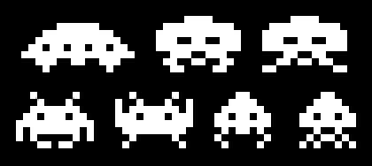

# PACMAN-x86

A learning project in **16-bit real-mode x86 assembly**: a tiny bootloader and small "games" that run straight from a floppy image, with no operating system, using only BIOS interrupts and VGA mode 13h (320×200, 256 colours).

<p align="center">
  
</p>

> **Status: prototype / learning demos.**
> Pac-Man can be drawn and moved around with the keyboard, but there is **no game logic**: no ghost AI, no pellets or score, no maze collision, no win/lose state. Everything here is an experiment in bare-metal graphics, input and debugging.

---

## Contents

- [What's in the repo](#whats-in-the-repo)
- [How it boots](#how-it-boots)
- [Requirements](#requirements)
- [Build and run](#build-and-run)
- [The debugger](#the-debugger)
- [The Pac-Man prototype](#the-pac-man-prototype)
- [Other demos](#other-demos)
- [Graphics references](#graphics-references)
- [Known quirks](#known-quirks)
- [Roadmap](#roadmap)

---

## What's in the repo

| File | Purpose |
|---|---|
| [bootloader.asm](bootloader.asm) | Stage 1 boot sector (512 bytes). Loads the next 4 sectors to `0x9000` with `INT 13h` and jumps there. |
| [game.asm](game.asm) | Stage 2 currently built by `build.sh`: a minimal demo that moves a single white pixel with **W A S D**. |
| [unfinished_pacman_16bit_asm.txt](unfinished_pacman_16bit_asm.txt) | The **Pac-Man prototype**: maze drawing, animated Pac-Man sprite in 4 directions, WASD movement, screen-edge clamping and a fixed "walking route" demo. |
| [asm_script.txt](asm_script.txt) | A scrapbook of earlier experiments: text input/echo, coloured text, pixel drawing, colour-cycling, sprite texture swapping and a **Space Invaders** prototype. |
| [build.sh](build.sh) | Assembles both stages, builds a 1.44 MB floppy image and launches QEMU (normal or debug). |
| [debug_script.gdb](debug_script.gdb) | GDB script that attaches to QEMU and runs a live instruction/register tracer. |
| [bochsrc.bxrc](bochsrc.bxrc) | Alternative config for the Bochs emulator (boots `bootloader.img` from floppy A). |
| [test_build.sh](test_build.sh) | Sanity check for the toolchain: builds a DOS `hello.com` and runs it in DOSBox. |
| [16BIT_ASM_DOCUMENTATION.md](16BIT_ASM_DOCUMENTATION.md) | Notes on registers, segmented addressing, the instruction set and the FLAGS register. |
| [asm_help.txt](asm_help.txt) | Cheat sheet: registers, BIOS interrupts (`10h`, `13h`, `16h`, `19h`, `1Ah`) and string instructions. |
| [asm_game.txt](asm_game.txt) | ASCII code table plus notes on `stosb` / `stosw` / `movsb` / `movsw`. |
| `pacman.png`, `pacman_low.png`, `Spaceinvaders.webp` | Design references for the maze and sprites (see [Graphics references](#graphics-references)). |
| `bootloader.bin`, `game.bin`, `bootloader.img` | Build outputs (committed for convenience). |

---

## How it boots

```
 BIOS ──► loads sector 1 (bootloader.bin) to 0000:7C00
            │
            │  INT 13h, AH=02h: read 4 sectors from C0/H0/S2 → 0000:9000
            ▼
          jmp 0x9000 ──► stage 2 (game) takes over
                           • INT 10h  AX=0013h → VGA 320×200×256
                           • writes pixels directly to segment A000h
                           • polls the keyboard with INT 16h
```

Floppy image layout produced by `build.sh`:

| Sector | Offset | Content |
|---|---|---|
| 1 | `0x0000` | `bootloader.bin` (ends with signature `0xAA55`) |
| 2–5 | `0x0200` | stage 2 binary (`game.bin`), loaded to `0x9000` |
| rest | | zeros (image is 2880 × 512 bytes = 1.44 MB) |

---

## Requirements

Developed on Windows with **MSYS2**:

- [NASM](https://www.nasm.us/): assembler
- [QEMU](https://www.qemu.org/) (`qemu-system-x86_64`): emulator
- `dd`: available in MSYS2
- **GDB** + **mintty** (MSYS2 terminal): only needed for debug mode
- *Optional:* [Bochs 2.8](https://bochs.sourceforge.io/) and DOSBox

In an MSYS2 shell:

```bash
pacman -S nasm mingw-w64-x86_64-qemu gdb
```

---

## Build and run

```bash
./build.sh -n    # build and run normally in QEMU
./build.sh -d    # build and run in QEMU with the GDB debugger attached
```

Both modes:

1. assemble `bootloader.asm` → `bootloader.bin` and `game.asm` → `game.bin`
2. create a blank 1.44 MB `bootloader.img`
3. write the bootloader to sector 1 and the game to sector 2
4. start QEMU with `-drive format=raw,file=bootloader.img -icount shift=1`

`-icount shift=1` makes QEMU run at a fixed, slower instruction rate, so the busy-wait delay loops in the demos give a steady, watchable speed.

**Controls:** `W` up · `A` left · `S` down · `D` right

### Using Bochs instead

`bochsrc.bxrc` boots the same image in Bochs. The paths in it are absolute (`C:\msys64\home\nikit\bootloader.img` and the Bochs install folder), so edit `floppya:` / `romimage:` for your machine first.

---

## The debugger

`./build.sh -d` turns the project into a step-through debugging session:

1. QEMU starts **paused** (`-S`) with a GDB server on `localhost:1234` (`-s`).
2. After 2 seconds a new **mintty** window opens with `gdb -x debug_script.gdb`.
3. The script:
   - connects to QEMU (`target remote localhost:1234`)
   - sets a breakpoint at `0x9099` (inside the stage 2 code at `0x9000`) and continues until it is hit
   - enters `disassemble_realtime`, an endless loop that for every instruction:
     - prints all registers (`info registers`)
     - disassembles the current instruction (`x/i $pc`)
     - single-steps (`si`)
     - sleeps 10 ms so the output stays readable

The result is a **live trace** of the program: you can watch the registers and each instruction scroll by while the game runs in the QEMU window. Press `Ctrl+C` in GDB to stop the trace and inspect state by hand.

To trace a different part of the code, change the breakpoint address. Code is loaded at `0x9000`, so a label at offset `N` in the binary is at `0x9000 + N`.

> GDB treats the target as x86-64 by default. For cleaner 16-bit disassembly, add `set architecture i8086` to the script.

---

## The Pac-Man prototype

Source: [unfinished_pacman_16bit_asm.txt](unfinished_pacman_16bit_asm.txt)

**What works**

- **Maze rendering:** the walls are built from tables of rectangles (`map_x/y/w/h`, 23 blocks). It draws a blue layer, then shrinks every block by `size_r` (6 px) with `sizer_a`/`sizer_b` and draws a black layer on top, which leaves hollow blue outlines like the arcade maze.
- **Pac-Man sprite:** 13×13 px, drawn row by row (or column by column) from run-length tables, with separate routines for right, left, up and down (`draw_pacman_*`).
- **Movement:** `wasd_key` erases the sprite (redraws it in colour 0), moves it by `move_speed` (3 px) and redraws it facing the new direction.
- **Screen-edge clamping:** `wall_collision` keeps Pac-Man inside the 320×200 screen. It is currently commented out in the game loop.
- **Demo route:** `walking_rout` moves Pac-Man around the outer corridor on its own, using `INT 15h, AH=86h` for timing. This is a scripted path, not AI.
- **Helpers:** `sleep` (BIOS wait), `clock` (RTC read via `INT 1Ah`), `test_screen` (colour test pattern).

**What is missing**

- Collision with the maze walls (only the screen edges are handled)
- Ghosts: `draw_ghost` is a stub with sprite data only; there is no drawing or AI
- Pellets, power pellets, fruit, score and lives
- Tunnels, win/lose conditions and game states

### Running the prototype

`build.sh` builds `game.asm`. To boot the Pac-Man prototype instead:

1. Copy `unfinished_pacman_16bit_asm.txt` to `game.asm` (or change the `nasm` line in `build.sh`).
2. Change `org 0x8000` to **`org 0x9000`**, the address the bootloader loads and jumps to.
3. Remove the `mov ah, 0x48 / int 0x21` lines at the top. `INT 21h` is a DOS service and doesn't exist on bare metal.
4. Make sure the binary fits in the sectors the bootloader reads (`mov al, 4` = 2 KB). Increase that value if the program is larger.

---

## Other demos

[asm_script.txt](asm_script.txt) collects earlier stand-alone experiments. Each block has its own `org 0x9000` header and can be pasted into `game.asm` to try it:

- **Text I/O:** read keys into a buffer, echo them, and print them back after Enter
- **Coloured text:** BIOS teletype output with colour attributes
- **Pixels and colours:** plotting through `INT 10h, AH=0Ch` and a colour-cycling rainbow
- **Graphic development:** Pac-Man sprite drawing with horizontal/diagonal texture swapping (mirroring the sprite)
- **Space Invaders** (`LATEST SPACE INVADER`): a grid of bit-pattern aliens with a two-frame animation, a player ship moved by the keyboard, and a single bullet

---

## Graphics references

These images are **design targets and mockups**, not screenshots of the running code.

<table>
  <tr>
    <td align="center"><br><sub><b>pacman.png</b>: full maze at the native 320×200 resolution, with the maze layout, ghosts, fruit and pellets the game is aiming for.</sub></td>
    <td align="center"><br><sub><b>pacman_low.png</b>: sprite sheet with Pac-Man frames, the four ghosts, frightened ghosts, eyes, pellets and fruit.</sub></td>
  </tr>
  <tr>
    <td colspan="2" align="center"><br><sub><b>Spaceinvaders.webp</b>: reference alien sprites for the Space Invaders demo.</sub></td>
  </tr>
</table>

---

## Known quirks

These are worth knowing if you study the code:

- **`game.asm` uses `org 0x7c00` but is loaded at `0x9000`.** It still works because its jumps are relative and it sets `DS = ES = 0xA000`. As a side effect, its variables (`player_x`, `player_y`, …) are read and written **inside video memory**, not next to the code.
- **Movement flags are never cleared in `game.asm`.** After a direction key is pressed, the pixel keeps moving that way, and pressing more keys combines the directions.
- **No double buffering or vsync.** Sprites are erased and redrawn in place, so some flicker is expected.
- Delays are busy-wait loops (`loop` on `CX = 0xFFFF`) or `INT 15h/86h`, so speed depends on the emulator (hence `-icount`).

---

## Roadmap

- [ ] Make the Pac-Man prototype the default stage 2 build
- [ ] Tile-based maze collision
- [ ] Pellets, score and lives
- [ ] Ghost sprites and movement, then chase / scatter / frightened AI
- [ ] Timer-based game loop (PIT / `INT 08h`) instead of busy waiting
- [ ] Bigger bootloader read, or read sectors in a loop, for a larger game

---

## Resources

- [Ralf Brown's Interrupt List](https://www.ctyme.com/rbrown.htm): BIOS/DOS interrupt reference
- [OSDev Wiki: Real Mode](https://wiki.osdev.org/Real_Mode) and [Drawing in a Linear Framebuffer](https://wiki.osdev.org/Drawing_In_a_Linear_Framebuffer)
- [NASM documentation](https://www.nasm.us/docs.php)
- [The Pac-Man Dossier](https://pacman.holenet.info/): how the original ghost AI works
